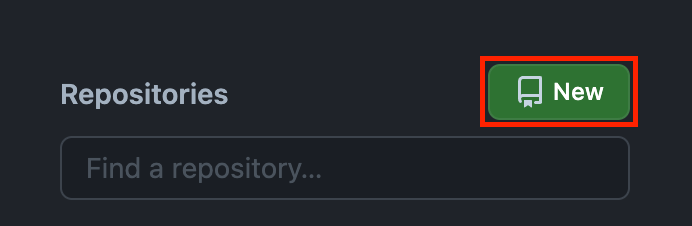
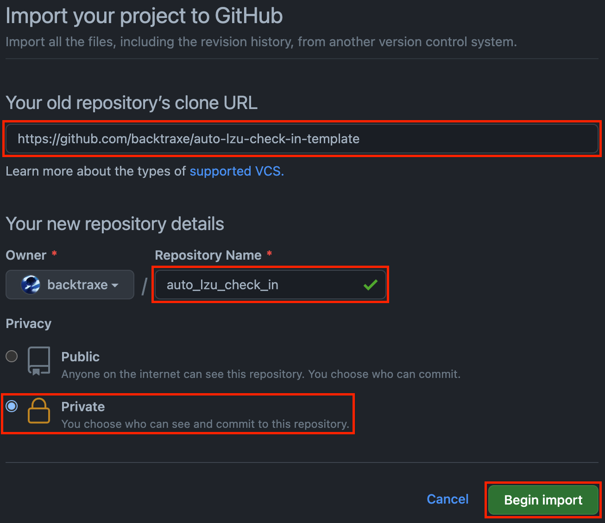
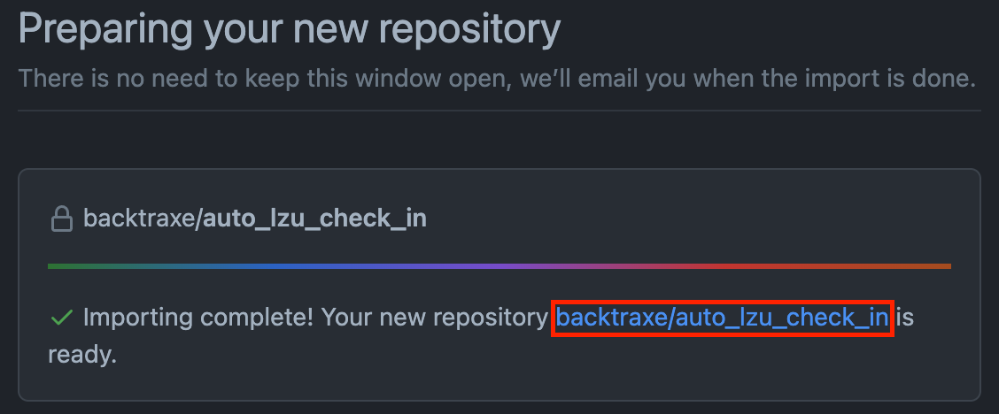
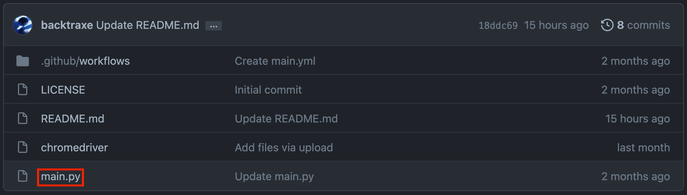
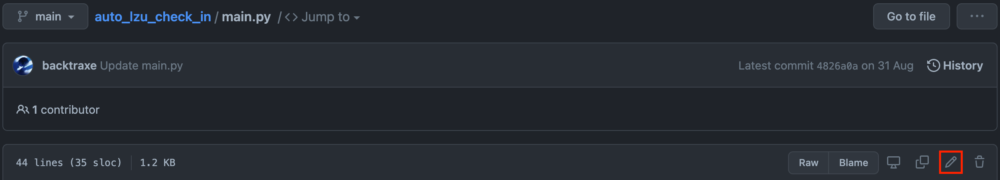
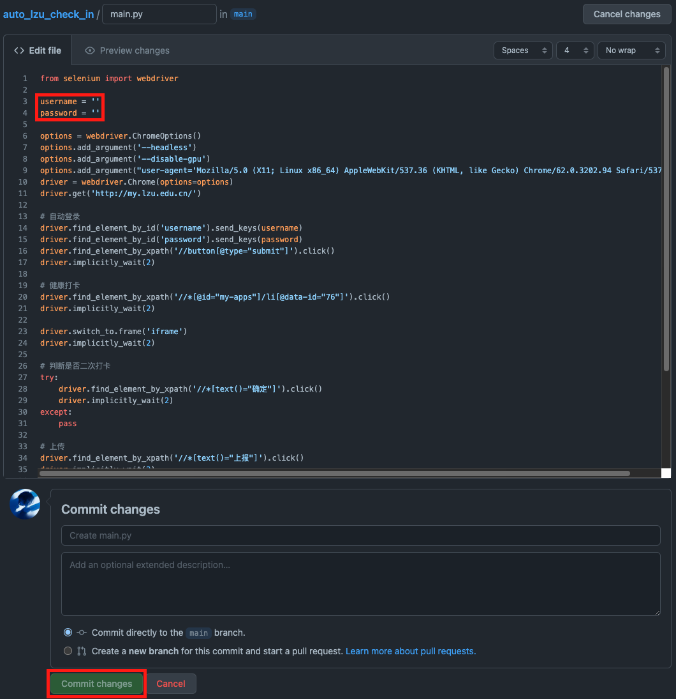
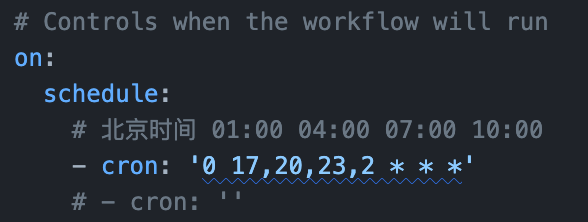

# auto_lzu_check_in_template

兰州大学自动每日健康打卡

步骤：

1. 新建仓库。

2. 选择`Import a repository`。

3. 填入`https://github.com/backtraxe/auto_lzu_check_in_template`，名字随意，选择`private`（确保密码不公开），然后导入。

4. 进入创建的仓库。

5. 打开`main.py`。

6. 编辑`main.py`。

7. 填入自己的学号和密码（用来登录兰大个人工作台），然后保存并提交。

8. 编辑`.github/workflows/main.yml`，将`- cron: ''`改为`- cron: '0 17,20,23,2 * * *'`，然后保存并提交。

