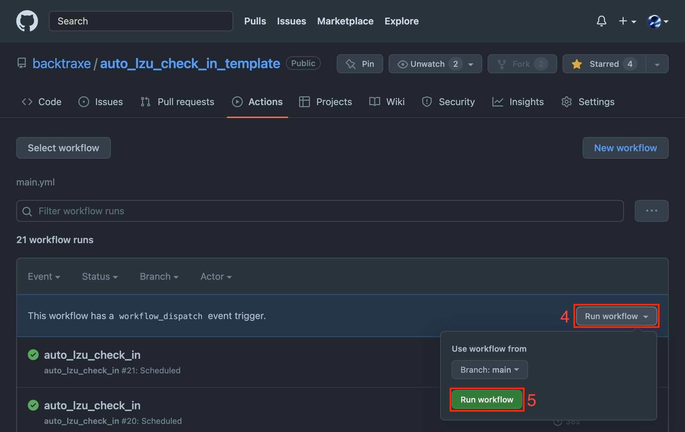
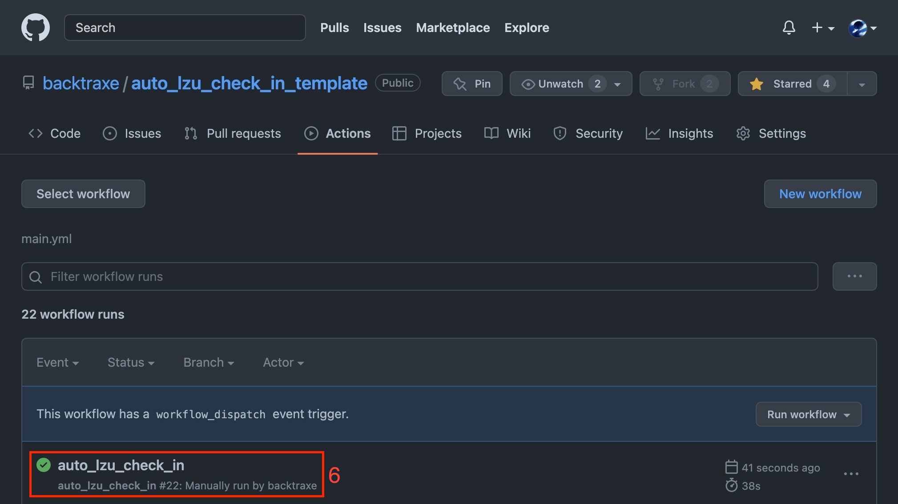

# 兰州大学自动每日健康打卡

## 1. `Fork`本仓库。

 

## 2. 进入到`Fork`后的仓库，点击`Settings`->`Secrets`->`Actions`->`New repository secret`，添加`Name`为`USERNAME`和`PASSWORD`的两个 secret，`Value`为用户名和密码（不会泄露）。

 

## 4. 测试。点击`Actions`->`Select workflow`->`auto_lzu_check_in`->`Run workflow`->`Run workflow`，然后刷新页面，等待一段时间，出现绿色运行记录即为测试成功。

